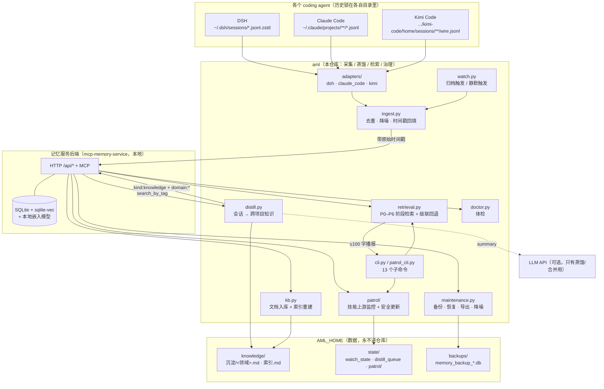

# 架构

## 总览

## 三个循环

| 循环 | 触发 | 做什么 |
|---|---|---|
| **采集** | `aml watch` 常驻：DSH 归档事件 或 会话文件静默 ≥120s | 增量入库（一条"任务"一条"回复"），并把 `created_at` 回填成**原始时间** |
| **蒸馏** | 会话关闭后入队（可配门槛：DSH 要求 ≥3 轮任务，挡子代理噪声） | 取该会话已入库的记忆 → LLM 提炼成跨项目知识（`kind:knowledge` + `domain:*` + 复核期）→ 写回记忆层 + 落 markdown |
| **治理** | `aml patrol run` 每天一次 | 技能上游版本探测（`git ls-remote`）→ 干净就自动更新、改过就只暂存 → 镜像进知识库 → 包版本监控 → 写播报队列 |

## 为什么这么切

**1. 后端不自己实现。** 向量库、嵌入、HTTP/MCP 由 `mcp-memory-service` 提供——
那是成熟件，重复造只会得到更差的实现。`aml` 只补它**没有**的四件事：
多 agent 采集、蒸馏分层、阶段检索、技能治理。

**2. 采集与存储解耦。** adapters 只回答两个问题：会话文件在哪（`discover()`）、
怎么解析成 `Turn`（`turns()`）。新增一个 agent = 一个模块 + 注册一行，不碰存储层。

**3. 数据与程序彻底分离。** 程序在仓库里，数据在 `AML_HOME`
（`knowledge/` 可读镜像、`state/` 运行状态、`backups/` 备份）。
所以仓库可以公开，`.gitignore` 里那一串就是这条边界。

**4. 两副面孔。** 向量库负责快，markdown 镜像负责"永远读得到"。
`索引.md` 能从库重建（`aml index rebuild`），`沉淀/*.md` 也能（`aml distill --rebuild-md`）——
索引腐化与数据锁定是两个真实的失效模式，各配一条重建命令。

## 已知失效模式与对应处理

| 失效模式 | 症状 | 处理 |
|---|---|---|
| **索引腐化** | 索引自报条数 ≠ 库内条数（实测差过 1002 条） | `aml doctor` 会比对并告警；`aml index rebuild` 重建 |
| **记录缺向量** | 某条记忆**永远搜不到**（语义检索对它无感） | `doctor` 报向量覆盖率；`aml backfill-embeddings` 重嵌入 |
| **false empty** | 库里有、查询却返回 0 条，调用方误判"没有" | 级联回退 + 未命中必须解释（见 `docs/PROTOCOL.md`） |
| **只有备份没有恢复** | 库损坏时无从下手 | `aml restore`：预检 → integrity_check → 自动另存现有库 → 恢复 → 复验 |
| **自动更新冲掉本地改动** | 用户改过的 skill 被上游覆盖 | patrol 三条安全闸门：`local_patch`/指纹不符只暂存，覆盖前必备份 |
| **后台跑的东西用户看不见** | 更新了但没人知道 | 通知队列 + 回答结尾 ≤100 字播报（`patrol notify --brief`） |
| **编码坑（中文 Windows）** | 日志乱码、emoji 直接崩、`.ps1` 语法错 | 可执行入口强制 UTF-8 stdio；`.ps1` 带 BOM；`.vbs` 纯 ASCII |

## 扩展点

- **新 agent**：`src/aml/adapters/<name>.py`（实现 `discover()` / `turns()`）+ 注册一行 + 合成数据测试
- **新阶段**：`retrieval.phases`（条数/字数/意图），协议说明见 `docs/PROTOCOL.md`
- **新知识类型**：`distill.REVIEW_DAYS` 加类型 → 复核期；标签用 `ktype:<类型>`
- **新上游仓库**：`patrol.candidate_repos`（目录名命中 ≥`min_repo_hits` 才认）
- **新后端**：只要实现 `MemoryClient` 的那几个方法（search / store / list / delete）
